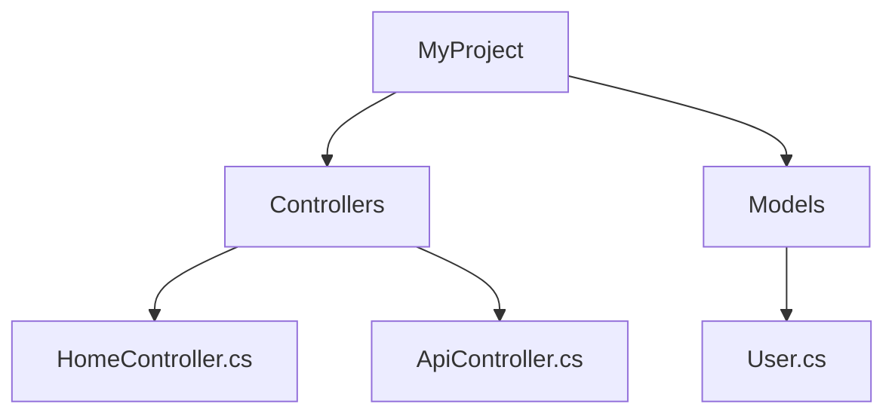

# SolutionMapper

Visual Studio extension to export your solution structure in multiple formats - perfect for documentation, onboarding, and architecture reviews.

## Features
- **Multiple export formats**: Text, Markdown, HTML, JSON, YAML, and Mermaid diagrams
- **Code analysis**: Optional inclusion of classes and methods from C# files
- **Interactive HTML**: Collapsible tree view with syntax highlighting
- **Mermaid diagrams**: Perfect for GitHub/GitLab documentation
- **Smart filtering**: Automatically excludes build artifacts and version control folders
- **Clean output**: No more cluttered exports with thousands of Git files

## What's New in v1.1

### Version Control Exclusions
- **Automatically excludes** `.git`, `.svn`, `.hg`, `.bzr`, and `_darcs` folders
- **Dramatically smaller exports** - projects with large Git histories now generate clean, focused output

## Installation

### From Visual Studio Marketplace
1. Go to **Extensions** → **Manage Extensions**
2. Search for "SolutionMapper"
3. Click **Download** and restart Visual Studio

### Manual Installation
1. Download the latest `.vsix` file from [Releases](https://github.com/tjgokken/SolutionMapVS/releases)
2. Double-click the `.vsix` file to install

## Usage

### Quick Start
1. **Open** a solution in Visual Studio
2. **Go to** **Tools** → **SolutionMapper** (or right-click solution in Solution Explorer)
3. **Choose** your preferred export format
4. **Optional**: Check "Include code details" for classes/methods
5. **Save** the generated file

### Export Formats

| Format | Best For | Output |
|--------|----------|---------|
| **Text** | Quick overview | Simple tree structure |
| **Markdown** | GitHub/GitLab docs | `.md` file with headers |
| **HTML** | Interactive viewing | Collapsible web page |
| **JSON** | Programmatic use | Structured data |
| **YAML** | Configuration-like | Human-readable structure |
| **Mermaid** | Diagrams | GitHub/GitLab flowcharts |

### Example Output

**Markdown Format:**
```markdown
# MyProject
- Controllers/
  - HomeController.cs
  - ApiController.cs
- Models/
  - User.cs
  - Product.cs
- Views/
  - Home/
    - Index.cshtml
```

**Mermaid Diagram:**


## Excluded by Default

The extension automatically excludes common build and version control folders:
- **Build artifacts**: `bin/`, `obj/`, `packages/`
- **IDE files**: `.vs/`, `.vscode/`
- **Version control**: `.git/`, `.svn/`, `.hg/`, `.bzr/`, `_darcs/`
- **Dependencies**: `node_modules/`

## Use Cases

- **Documentation**: Generate project structure for README files
- **Onboarding**: Help new developers understand codebase layout  
- **Architecture reviews**: Visualize project organization
- **Presentations**: Create diagrams for technical discussions
- **Code analysis**: Export structure for external tools

## Requirements

- Visual Studio 2022 (Community, Professional, or Enterprise)
- .NET Framework 4.8+

## Contributing

Contributions are welcome! Please feel free to:
- Report bugs via [Issues](https://github.com/tjgokken/SolutionMapVS/issues)
- Suggest features
- Submit pull requests

## Changelog

### v1.1 (Latest)
- Added version control folder exclusions (.git, .svn, etc.)
- Significantly reduced export file sizes
- Improved performance for large repositories

### v1.0
- Initial release
- Multiple export formats
- Code details support
- Interactive HTML view

## License

MIT License - see [LICENSE.txt](LICENSE.txt)

---

**Found this useful?** Please star the repo and leave a review on the [Visual Studio Marketplace](https://marketplace.visualstudio.com/)!